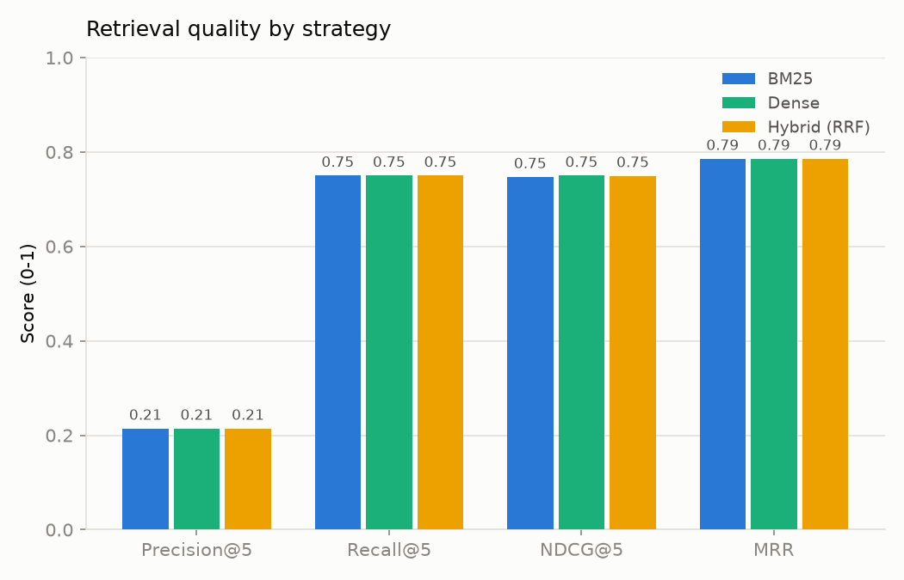
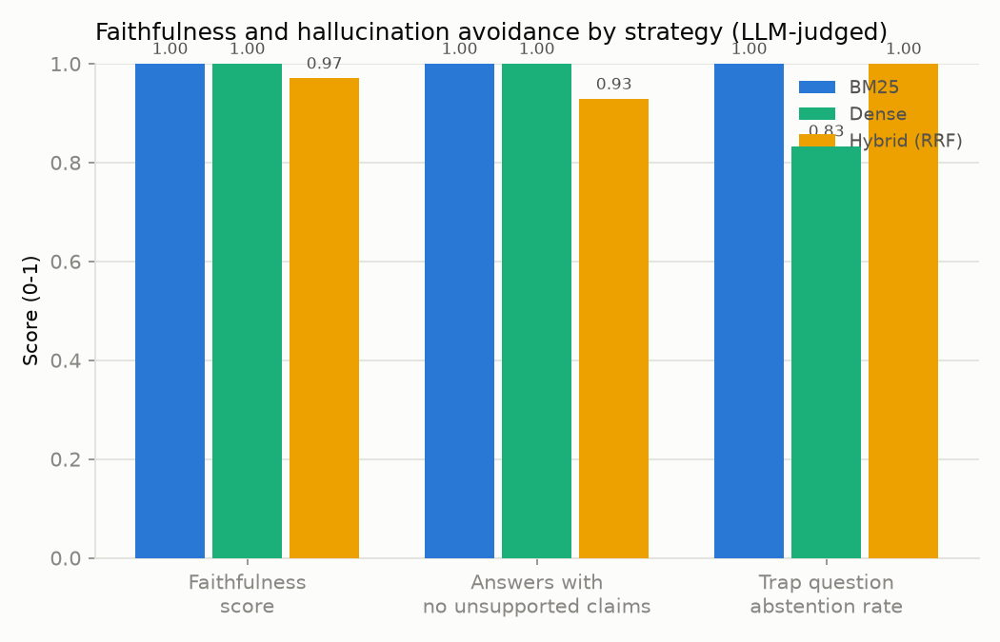
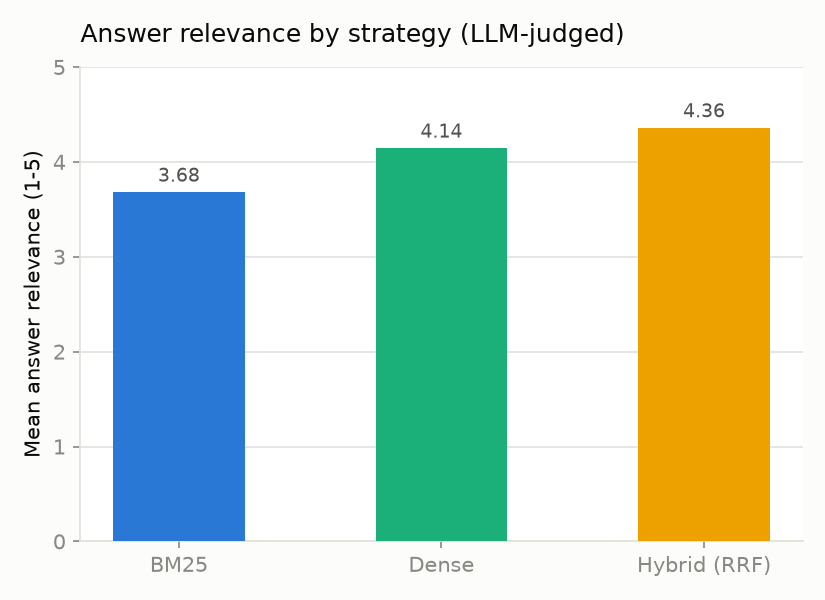

# RAG Retrieval Quality Report

Generator model: `qwen2.5:3b` &nbsp;|&nbsp; Judge model: `qwen2.5:3b` &nbsp;|&nbsp; Questions evaluated: 28 &nbsp;|&nbsp; Strategies compared: BM25, Dense, Hybrid (RRF)

> **Methodology note:** Precision@k, Recall@k, NDCG@k, and MRR are computed against hand-labeled gold-relevant chunk IDs — they are ground truth. Faithfulness, the hallucination-related metrics, trap abstention rate, and answer relevance are **LLM-judged** (by the judge model above) and should be read as a consistent, explainable proxy rather than ground truth.

## Summary: Dense wins

Ranked by NDCG@5 (retrieval quality) then faithfulness score (answer grounding) as a tiebreaker, **Dense** performed best overall on this eval set. See the per-metric tables and charts below for the full picture — the best strategy can vary by metric.

## Retrieval Metrics (ground truth)

|              |   Precision@5 |   Recall@5 |   NDCG@5 |   MRR |
|:-------------|--------------:|-----------:|---------:|------:|
| BM25         |         0.214 |       0.75 |    0.747 | 0.786 |
| Dense        |         0.214 |       0.75 |    0.75  | 0.786 |
| Hybrid (RRF) |         0.214 |       0.75 |    0.749 | 0.786 |

## Faithfulness and Hallucination (LLM-judged)

|              |   Faithfulness score |   Hallucination rate (>=1 unsupported claim) |   Trap question abstention rate |   Context utilization |
|:-------------|---------------------:|---------------------------------------------:|--------------------------------:|----------------------:|
| BM25         |                 1    |                                        0     |                           1     |                 0.207 |
| Dense        |                 1    |                                        0     |                           0.833 |                 0.2   |
| Hybrid (RRF) |                 0.97 |                                        0.071 |                           1     |                 0.229 |

## Answer Relevance (LLM-judged)

|              |   Mean answer relevance (1-5) |
|:-------------|------------------------------:|
| BM25         |                          3.68 |
| Dense        |                          4.14 |
| Hybrid (RRF) |                          4.36 |

## Example Failure Cases

### Case 1

**Question** (hybrid, easy): What is the minimum password length required by Northwind Cloud's security policy, and does the company force periodic password rotation?

**Retrieved chunks:** security-policy-0, code-of-conduct-0, remote-work-policy-0, data-processing-agreement-0, authentication-0
**Gold-relevant chunks:** security-policy-0

**Generated answer:** The minimum password length required by Northwind Cloud's security policy is 14 characters.

Northwind Cloud does not enforce periodic password rotation; it follows industry best practices that discourage mandatory password changes without cause. Instead, passwords are checked against known-breach databases and require immediate change if a match is found.

**Faithfulness:** 0.50 (claims:
  - [supported] Passwords must be a minimum of 14 characters.
  - [unsupported] Northwind Cloud forces periodic password rotation.
)

**Answer relevance:** 2/5 — The provided answer partially addresses the first part of the question (minimum password length) but does not address the second part regarding whether periodic password rotation is enforced or not by Northwind Cloud's security policy. The answer shifts focus to mandatory password change requirements in case a password matches known-breach databases, which is not directly related to the original question.

### Case 2

**Question** (bm25, medium): If I'm on the Pro tier and my application starts hitting 429 errors, what's my rate limit and what retry strategy should I implement?

**Retrieved chunks:** rate-limits-0, webhooks-0, data-processing-agreement-0, onboarding-checklist-0, error-codes-0
**Gold-relevant chunks:** pricing-tiers-0, rate-limits-0

**Generated answer:** For the Pro tier, your rate limit is 1,500 requests per minute. When your application hits a 429 error, you should implement an exponential backoff with jitter: start with a 1-second delay and double it on each subsequent occurrence of a 429 until the cap at 60 seconds.

**Faithfulness:** 1.00 (claims:
  - [supported] For the Pro tier, your rate limit is 1,500 requests per minute.
  - [supported] When your application hits a 429 error, you should implement an exponential backoff with jitter: start with a 1-second delay and double it on each subsequent occurrence of a 429 until the cap at 60 seconds.
)

**Answer relevance:** 3/5 — The answer provides specific information about rate limits for the Pro tier (1,500 requests per minute) and suggests an exponential backoff with jitter strategy to handle 429 errors. Although it does not directly address whether the questioner is on the Pro tier or the exact details of their current usage status, which were asked in the original query, this information could be inferred as useful context for resolving the issue.

### Case 3

**Question** (dense, trap): What uptime percentage does Northwind Cloud guarantee in its SLA (e.g., 99.9%)?

**Retrieved chunks:** pricing-tiers-0, customer-support-sla-0, billing-invoicing-0, monitoring-alerting-0, rate-limits-0
**Gold-relevant chunks:** (none — trap question)

**Generated answer:** I don't have information about that in the provided context.

**Faithfulness:** 1.00 (claims:
  - [supported] The support response-time commitments are tied to pricing tier.
  - [supported] Starter tier has an email support with a 24-hour first-response SLA during business days.
  - [supported] Pro tier has live chat support, 4-hour first-response SLA, and is available 7 days a week.
  - [supported] Enterprise tier has dedicated support with a 1-hour response SLA, 24/7 availability, plus a named customer success manager.
)

**Answer relevance:** 5/5 — The answer correctly states that it doesn't have the specific information needed to address the question, which means it's a correct refusal and relevant to the context.

## Per-Question Results

Full per-question, per-strategy results are saved alongside this report in `results.json` for further inspection.
